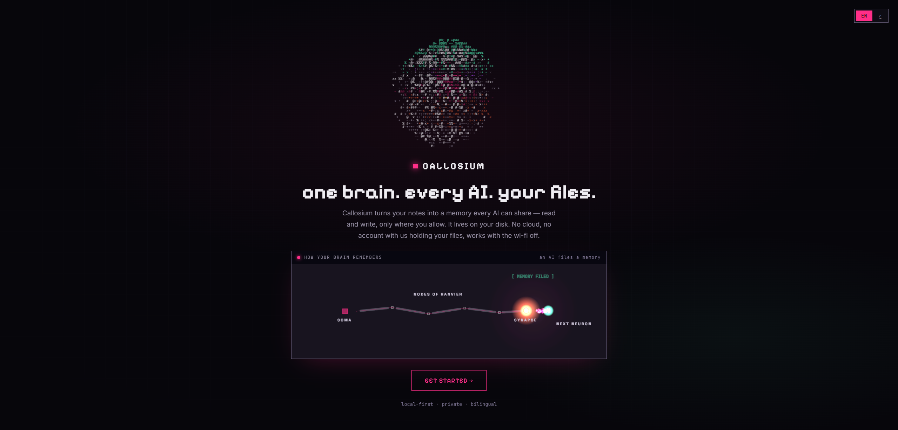
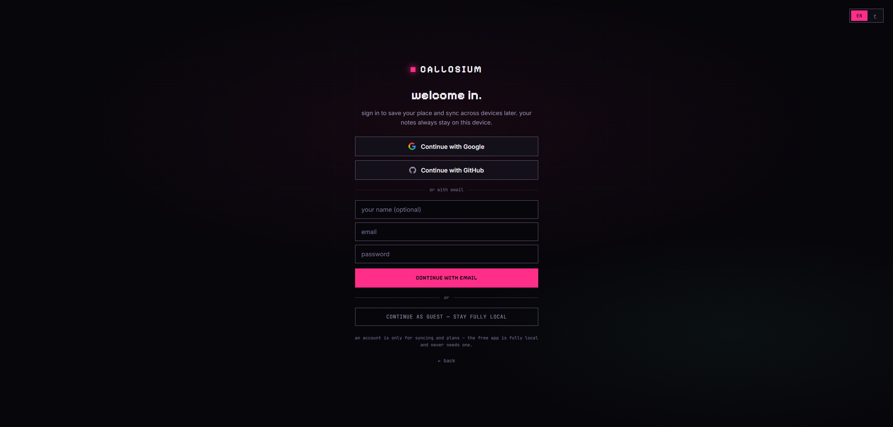
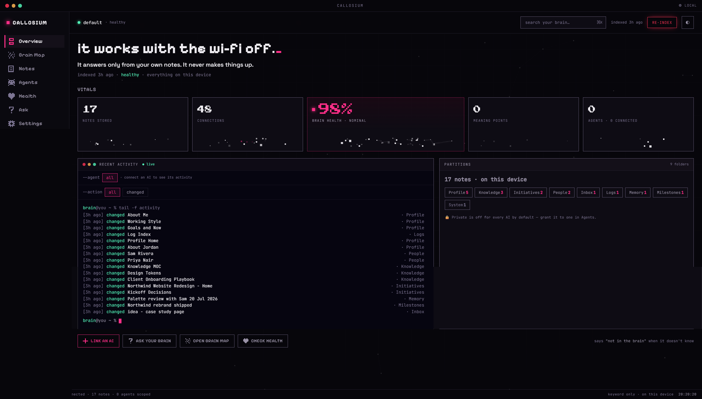
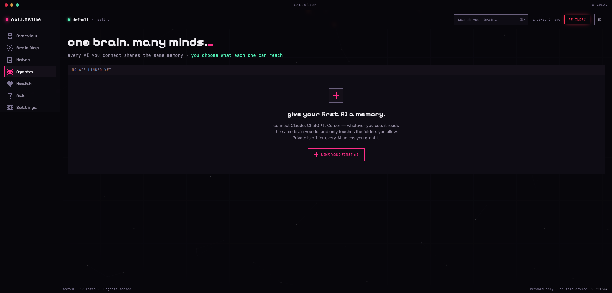
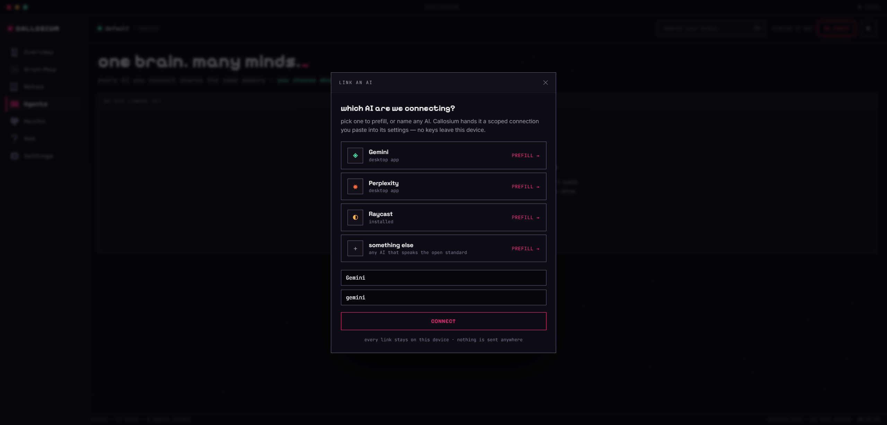
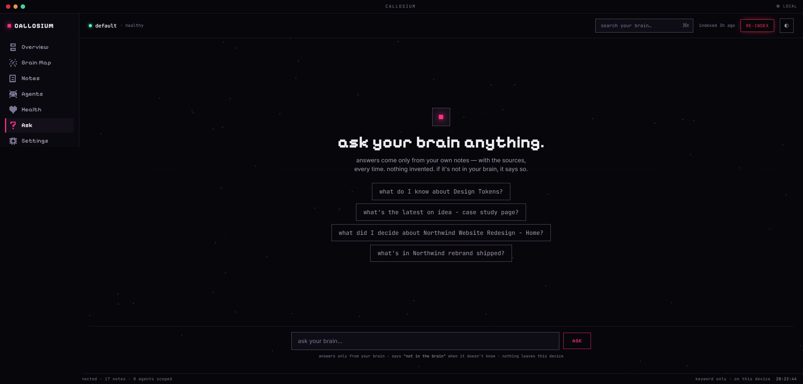
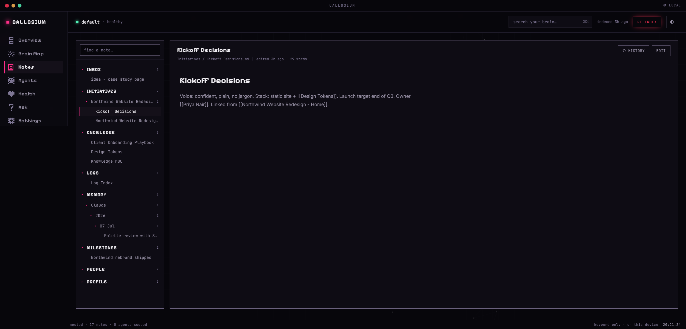
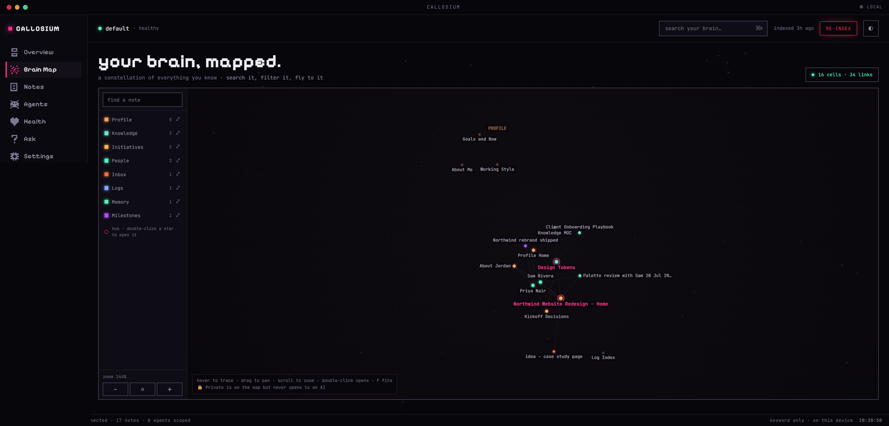
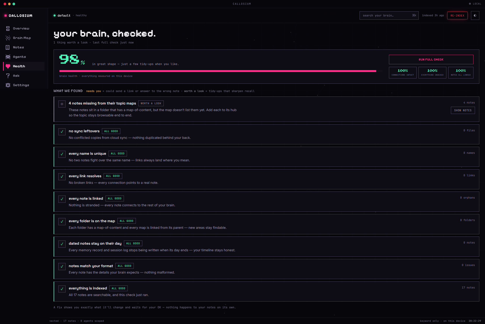
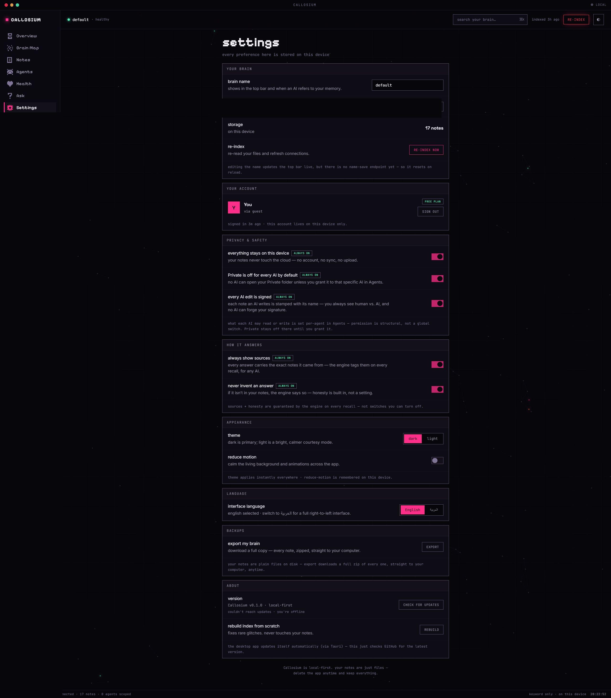

# Callosium

**Every AI you use forgets you. Callosium gives them one shared memory, in plain files you own.**

You explain your project to Claude. Then you explain it again to ChatGPT. Then again to Cursor. Every chat starts from zero, and everything you have ever told an AI is scattered across apps that do not talk to each other.

Callosium fixes that. It turns a folder of plain Markdown on your computer into a **brain any AI can use**: they recall what you know before answering, save what they learn in the right place, and cite exactly where every answer came from. Your files never leave your machine.

- **One brain, every AI.** Claude, Cursor, ChatGPT-compatible apps, 23 clients supported, all reading and writing the same memory.
- **Plain files you own.** Markdown on your disk. No database, no cloud, no account required. Uninstall tomorrow and your notes are still just notes.
- **It does not make things up.** Across 15,000 test questions it invented nothing. When the answer is not in your notes, it says so. ([the numbers](#the-proof))
- **Works offline, in English and Arabic.** Everyday recall needs no internet, no API key, and no large language model.

---

## Table of contents

- [A guided tour](#a-guided-tour)
- [Install and first run](#install-and-first-run)
- [Connect your AI](#connect-your-ai)
- [What your AI can do once connected](#what-your-ai-can-do-once-connected)
- [Why it is different](#why-it-is-different)
- [The proof](#the-proof)
- [White paper](#white-paper)
- [Your files, your storage](#your-files-your-storage)
- [Docs and policies](#docs-and-policies)

---

## A guided tour

A walk through the local dashboard, shown on a dummy "Northwind Studio" brain (never real data).

### 1. Open it, and it works offline-first



### 2. Sign in, or stay fully local

Google, GitHub, email, or continue as guest. An account is only for syncing and paid plans; the free app never needs one, and your notes never leave the device either way.



### 3. The cockpit

Your brain at a glance: notes stored, connections, health, and a live feed of every change, human or AI.



### 4. Connect any AI, scoped to what you allow

Every AI you connect shares the same memory, and you decide what each one can reach.



Pick a client and Callosium hands it a scoped connection to paste into its settings. Nothing is sent anywhere.



### 5. Ask your brain, and it answers only from your notes

Every answer cites the exact notes it came from. If it is not in your brain, it says so instead of guessing.



### 6. Your notes, linked and versioned

Browse everything, follow the `[[wikilinks]]`, and every note keeps a full version history one click from undo.



### 7. See the whole brain as a map

A constellation of everything you know, with the hubs to start from and every link between notes.



### 8. Keep it healthy

A one-click audit finds broken links, orphans, and gaps in your topic maps, and fixes only what you approve. Nothing changes on its own.



### 9. Privacy and honesty are on by default

Local-only, per-AI permissions, signed writes, always-cite, never-invent, bilingual, and a one-click export of every note. The guarantees are built into the engine, not switches you can forget to set.



---

## Install and first run

**Prerequisite:** [Node.js](https://nodejs.org) 20 or newer. Check with `node --version`.

### 1. Create a brain and open the dashboard

```bash
npx callosium init my-brain
npx callosium serve --brain my-brain
```

`init` scaffolds a brain (or adopts an existing Obsidian vault or folder of Markdown, your files are never reformatted). `serve` opens the local dashboard at **http://localhost:4319**.

> **First run downloads the language model** (about 120MB, one time) so meaning-based search works in English and Arabic. Fully offline after that. No internet on first run? Everything still works: keyword recall needs no model, and the smarter search switches itself on once the model is in place.

### 2. Follow the onboarding

The dashboard walks you through whichever situation you are in:

- **I already have notes** (an Obsidian vault or any folder of Markdown). Callosium reads it, connects it, and learns what it means. Obsidian stays your editor.
- **I have raw stuff** (messy text, exports, half-finished notes). Drop them in the Inbox and your AI files and links everything for you.
- **Start empty.** Your AI interviews you (who you are, what you are working on, who is around you) and writes your first memories.

At the end, the dashboard generates the exact config for your AI, plus the standing rules that make it use your brain automatically, every session.

> **On Linux:** the install pulls in GPU add-ons for the search library that Callosium never uses. It runs on the CPU everywhere. Measured in CI: **725MB installed on Linux vs 414MB on Windows and macOS**, so that is 311MB of downloaded code that never runs. Skip it:
> ```bash
> ONNXRUNTIME_NODE_INSTALL=skip npm install -g callosium
> ```
> Nothing is lost by skipping. Windows and macOS are not affected.

## Connect your AI

The dashboard's **Agents** screen generates a ready-to-paste config for each client (Claude Desktop, Cursor, and 20-plus others) and the standing rules that make the AI reach for your brain on its own. Two things make this different from pointing an AI at a folder:

- **Per-AI scoping.** You decide, from the dashboard, which folders each connected AI may even see. `Private/` is invisible unless you personally grant it.
- **Signed writes.** Every note an AI writes is stamped, server-side, with which AI wrote it. Unforgeable.

Once connected, your AI reads before it answers and files what it learns, without you prompting it each time.

## What your AI can do once connected

- **Ask before answering.** `recall` returns the right notes with the exact matching lines cited, in about 40ms. If the answer is not in your notes, it says so. It never invents.
- **Remember what it learns.** `write_note` files new knowledge in the right folder, links it to related notes, and stamps which AI wrote it.
- **Respect your privacy.** You decide per AI what each one can see.
- **Handle huge documents.** A 150,000-word reference doc comes back as a map, and the AI reads just the section that answers.
- **Navigate the whole brain.** `get_map` hands the AI a live routing map of how your brain is organized, so it knows where everything lives and where new things go.

## Why it is different

Plenty of tools can point an AI at a folder of Markdown. What sets Callosium apart is everything that happens after that:

- **It is measured, not asserted.** The 15,000-question benchmark *generator* ships in this repo: it builds the test from your own vault, on your own machine, so you can check the numbers yourself. Your questions are never uploaded, and the author's own question set is deliberately kept out. Most "AI memory" is graded by the vendor that sells it. See [the proof](#the-proof).
- **Every AI, scoped and attributed.** Connect Claude, Cursor, ChatGPT-compatible apps and more to the same brain. Each write is stamped with which AI made it, and you decide per-AI what each may even see.
- **Nothing gets lost, whoever edits it.** Every note is versioned automatically, whether an AI wrote it through Callosium or you edited the file yourself in Obsidian. Delete a note by accident and it is still there. Versions are kept outside your notes folder, so your vault never grows because of them, and they cost about 900 bytes each, so a hundred thousand edits is under 100MB.
- **No terminal to live in.** A local dashboard runs onboarding, the connection config for each AI, health checks, and search.
- **Bilingual by design.** Meaning-based recall works in English and Arabic, out of the box.
- **Actually yours.** Plain files on your own disk. No database, no cloud, no account. Uninstall tomorrow and your notes are still just notes.

## The proof

Not marketing math. Measured on the builder's own brain of 1,162 real notes, in English and Arabic:

- **96.4%** found on the 15,000-question benchmark
- **0 invented answers** across 1,450 trick questions about things that do not exist
- **about 49ms** for a typical query, 116ms for the slowest request in a hundred
- **English and Arabic at parity**

You can reproduce this on **your** brain, which is the only number that should convince you. The question generator and the grader both ship here (`test/`), read your own vault, and build the test set from your own notes. The author's own question set is deliberately not included, because it embeds real private note paths, so a benchmark you run on your own notes is worth more than one you download.

**Read the full [white paper](#white-paper) below.** It gives the honest breakdown: the hard hand-written benchmark (not just the synthetic one), the token-cost savings, the zero-inventions honesty result, the competitor comparison, and the story of a neural reranker that was built, measured, and removed because it cost more than it returned.

## White paper

*A technical white paper on the retrieval engine, its benchmarks, what every number means, and where it still falls short. Measured July 2026 on the builder's own real vault of roughly 1,150 Markdown notes, in English and Arabic. Every number here is reproducible on your own notes.*

---

### The short version

One thing held on every single question we tested: Callosium never made an answer up. Across 15,000 questions, including 1,450 traps about things that do not exist, it invented nothing. And given a follow-up call or two, a connected AI almost always retrieves the answer that is actually there. When a fact is not in your notes, it says so instead of guessing.

That shapes what the numbers are for. Given a couple of follow-up calls, a connected AI reaches the answer almost every time. So the question worth measuring is not "can it find the answer" but "how much work does it take to get there" and "does it ever lie." Those are what most of this paper measures.

Here is where the shipped engine lands:

| The headline | Result |
|---|---|
| Made-up answers, across 15,000 questions incl. 1,450 traps | **0** |
| Overall accuracy on the 15,000-question benchmark | **96.4%** |
| Retrieval latency, single machine | **~49ms typical, 116ms worst case** |
| One `recall` call fully answers a hard, hand-written question | about **72%** of the time |
| Context read per answer | about **3,400 tokens**, roughly 99% less than dumping files in |
| Finds the answer note vs. plain keyword search | about **4.6x** more often |
| English vs. Arabic | at parity |

The shipped engine has **no neural reranker**. One was built, measured, and removed. That story is in this paper too, because it is the clearest example of how this project treats its own numbers.

---

### The problem

You have thousands of notes: meetings, decisions, people, half-finished ideas, things you told an AI six months ago. When you ask an assistant "what did we decide about the pricing model," you want the answer from your own notes, in your own words, not a confident guess from the model's training data.

Most tools solve half of this. A vector database finds notes that are "semantically close" and hands back fuzzy neighbors. A keyword search finds exact words and misses everything phrased differently. Both will happily return something for a question they have no answer to. That last part is the dangerous one. A second brain that invents is worse than no second brain, because you stop trusting it and go back to scrolling.

Callosium is built around one rule: return what is actually written, cite it, and say "that is not in your brain" when it is not there.

### What Callosium is

Callosium turns a folder of plain Markdown on your computer into a brain that any AI can read and write over MCP (Model Context Protocol, the open standard AI assistants use to plug into outside tools). Before your AI answers, it pulls the relevant notes and cites them. When your AI learns something, it files it in the right place and stamps which AI wrote it. When the answer is not in your notes, it tells you plainly.

Your notes stay as plain files on your own disk. Nothing is uploaded to a service to make search work, and if you delete Callosium tomorrow the files are still sitting in your folder, readable in any app. That ownership runs through everything below.

### How the engine works

A query runs through several independent lanes at once, and their results are fused. None of them is a large language model. The whole core is deterministic and runs on your machine.

- **Title ladder** catches the known-item case, when you name a note more or less directly.
- **BM25F** does field-weighted keyword ranking (title, headings, and body carry different weight).
- **Section coverage** scores how much of your question a note's best passage actually answers, weighted by how rare each word is. A note that contains your rare, specific term beats a note that only shares common filler.
- **Proximity** rewards notes where your query words sit close together.
- **Graph** pulls in notes linked to strong matches, so context rides along.
- **Semantic** (a local multilingual embedding model) finds notes that mean the same thing in different words, which matters a lot for Arabic and for paraphrased questions.
- **Temporal** activates only when the question carries recency intent ("latest on," "what did I do last week," and the Arabic equivalents) and boosts fresh notes.

The lanes are combined with Reciprocal Rank Fusion, which merges rankings without needing the lanes to agree on a score scale. That fused order is the answer. There is no second-stage neural reranker: one was built, measured, and removed, for reasons worth reading below.

Everything runs locally. The only time Callosium touches the network is to sign in and to check for updates. No note ever leaves the device for a search.

### The honesty gate

After fusion, one check decides whether to answer at all. It measures the coverage of your question's rare, meaningful words in the note it would return. If that coverage is too low, or if most of the important words in your question are simply absent from your entire vault, the engine refuses and says so. A confirming vote from the semantic lane can rescue a note that is the right answer worded differently, but only when the specific thing you named is actually present somewhere in your notes.

That is the whole product in one sentence: it answers from your notes or it refuses. There is no generation step that could hallucinate.

---

### The benchmarks: two numbers, both real

We measure with two different tests, and we always label which is which, because the distance between them is the gap between a benchmark and daily life that most of this field never shows you.

- **CallosiumBench v4 (synthetic, 15,000 questions).** Questions generated from the notes themselves, across nine families and two languages. Excellent for catching regressions between builds, and easier than real life, because the wording of the question and the note tend to line up.
- **The hard human bench (84 questions).** Questions a person wrote by hand, phrased the way you actually half-remember something (for example, how you first met a particular colleague, outside the work context), graded by an independent model. None were copied from a note's own wording, which would quietly rig the test. Much closer to daily use, and much harder.

Both are true. The synthetic number is the stress test. The human number is real life.

#### CallosiumBench v4: the families

15,000 questions, generated from the actual vault, split across nine families and two languages:

- **known** (2,850): you name a note conversationally.
- **content** (2,150): you ask about a rare phrase buried in a note body.
- **typo** (2,150): one entity word is mangled, the way voice input mangles names.
- **temporal** (2,150): recency phrasing ("latest on X").
- **compare** (1,400): two things, both must be found.
- **ambiguous** (1,050): should trigger a clarifying question.
- **clean** (1,050): an exact title, should not trigger clarify.
- **negative** (1,450): a fabricated, non-existent entity that should be refused.
- **richness** (750): a build task that needs a whole cluster of notes, not a snippet.

Each question knows which note (or notes) is the right answer, and grading checks whether that note lands in the accepted short list of top results. Grading is by note, not by exact text, because a good retrieval either finds the right note or it does not.

#### One note on the "35%" scare

An earlier run of this same benchmark reported 35%. That number was a testing artifact, not the engine. The scenario file was generated on 12 July, before the vault's folders were renamed (Work Indigo Hive became Work, Memory Hub became Memory, Ventures became Initiatives). About 80% of its expected paths pointed at folders that no longer existed, so the grader was comparing today's correct answers against yesterday's addresses. Regenerating the questions against the current vault fixed it, and a remap of the old paths recovers 95.8% of the "misses," which proves the engine was retrieving correctly the whole time.

---

### Results

#### CallosiumBench v4, the shipped engine

**Overall: 96.4%** (94.4% before the honesty-gate fix described further down).

| Dimension | Score |
|---|---|
| Recall (known-item, conversational) | 98.9% |
| Deep recall (rare body words) | 95.2% |
| Typo tolerance (1 mangled word) | 92.5% (94% of clean performance) |
| Temporal (recency phrasing) | 97.8% |
| Multi-target (both found) | 94.5% |
| Ambiguity handling | 100% |
| Exact-title precision | 98.2% |
| Context richness (cluster coverage) | 95.7% |
| Clarify precision | fires on 100% of ambiguous, 0% of clean |
| Context usefulness (a real neighbor rides along) | 100% of 3,788 probes |

Latency, single machine: **49ms for the typical request (the median, written p50), 77ms at the 90th percentile, and 116ms for the slowest request in a hundred (p99).**

English and Arabic are at parity. Known-item is 98.7% Arabic and 99.2% English. Temporal is 98.4% and 97.1%. Content is 94.8% and 95.6%. The multilingual embedding model, not an English-only one, is why.

#### The hard human bench: how often one call is enough

This is the honest, real-life number. Single-shot means an independent grader (Claude Sonnet) saw only what one `recall` call returned, the strictest possible read, over the builder's messy real brain.

| Metric | Result |
|---|---|
| Fully correct on the first call | **71.8%** |
| Correct or partial on the first call | **77.5%** |

By category, fully correct:

| Category | Score |
|---|---|
| Temporal | 85.7% |
| Conceptual | 84.6% |
| Specific-fact | 79.2% |
| Relationship | 60.0% |
| Multi-hop | 52.9% |

Everything single-hop sits in the low-to-mid eighties. Multi-hop, where the answer lives half in one note and half in another, is the genuine weak spot and stays the weak spot. That is a retrieval-gathering problem, not a ranking one, and it is the honest open edge for after launch.

One thing we are upfront about, because most memory products bury it: grading is not exact. Two independent Sonnet graders scored the same answers about seven points apart (72% to 79% on identical data). So the single-shot figure honestly lives in a **roughly 72 to 79 percent band** depending on who grades. What does not wobble is the mechanical retrieval number below, where no grader is involved.

#### Speed and tokens: the part that saves real money

Per answered question, here is the context an AI actually has to read to answer, measured exactly, not estimated.

| Approach | Median tokens | Against Callosium |
|---|---|---|
| Callosium, targeted cited excerpts | ~3,400 | baseline |
| Dump the top five matching notes in full | ~255,000 | Callosium reads about 99% less |
| A careful keyword agent reading snippets | ~5,100 | Callosium reads about 35% less, and answers far more often |
| A perfect oracle handed the one right note | ~990 | Callosium reads more, on purpose, because it returns a small cited cluster |

The honest reading: against the common habit of just handing the model the relevant files, Callosium reads about 99% less to answer the same question. Against an oracle that already knows the exact file, it spends more, because it returns a cited cluster of a few notes rather than one, which is what lets the AI verify and follow the thread. All three are shown so no one can accuse the number of cherry-picking.

#### Against plain keyword search

We ran the same 71 answerable human questions through an agent that had only basic text-search and file-listing commands (`grep`, `ls`, `cat`) over the raw folder. This is roughly what you would do by hand without Callosium.

| | Answer note found in the results |
|---|---|
| Callosium, shipped | **46 / 71 (65%)** |
| Keyword agent | 10 / 71 (14%) |

About **4.6 times** more often. Plain keyword search buries the answer note under everything that happens to share a word. Callosium's ranking brings it to the top. This is the mechanical number, no grader involved.

---

### Honesty: the number that matters most

The negative family is 1,450 questions about things that do not exist, nonsense entities like "wuzzleforth" and "zorblatt." The engine should refuse every one.

Raw, it refused 74.7%. That number, on its own, would be misleading, so we did what we always do with a raw benchmark number: we had fifteen independent AI judges read every single one of the 367 cases the engine did not refuse, and classify what actually happened.

**The verdict: 0 of 367 were inventions.** Not one. In every case, the engine returned a real, existing note from the vault that simply had nothing to do with the made-up entity. It never fabricated a fact, never described the nonsense thing as if it were real. It cited real notes, which is the entire design.

So there are two honesty numbers, and both are true:

- **Hallucination rate: 0%.** Across 15,000 questions including 1,450 traps, the engine invented nothing.
- **Refusal precision: 74.7% raw, now 95.4% after a fix this round.** On roughly one in four traps, phrased as "latest on X" or "do you remember X," it surfaced recent real notes instead of saying "nothing matches."

The refusal weakness had a specific cause: for a recency-phrased question, the semantic lane would find a recent note close to the question's filler words ("latest," "the," "thing") and vote to confirm it, overriding the refusal even though the named entity was absent. The fix stops the semantic vote from rescuing a note when most of the question's meaningful words are absent from the vault. After it, refusal precision rises from 74.7% to **95.4%** (Arabic to 99.3%), and overall accuracy rises from 94.4% to **96.4%**, with temporal unchanged at 97.8%. Legitimate recency questions still answer normally.

We report the raw number, the judged number, and the fix in the same place on purpose. The claim is not "perfect." The claim is: it never makes things up, and when it is not sure we would rather it said so, and we are closing the gap where it does not.

There is a real distinction from tools that also score well on honesty. Some of them decline because they could not find anything at all, which is honesty by inability. Callosium declines on the genuine blanks while still answering the questions that do have an answer.

---

### The reranker, and why it is gone (an academic result)

The engine had an optional cross-encoder reranker, and it has been removed. That decision is worth publishing in full, on and off numbers side by side, because it is the clearest example of how this project treats its own numbers.

The theory is sound. A cross-encoder reads the question and a note together and scores true relevance, where the embedding lane only compares them separately. On a small hand-built set of exactly the hard, differently-worded questions it is meant to help, it looked like a clear win, and on that set it lifted single-shot accuracy about **+4.3 points** (71.8% to 76.1%). So it was switched on by default.

Then we ran it against the full 15,000. Same engine, same questions, the only difference the reranker:

| | Overall (15k) | Latency p50 / p90 / p99 |
|---|---|---|
| Reranker **off** (shipped) | **96.4%** | 49ms / 77ms / 116ms |
| Reranker **on** | 94.0% | 51ms / 1732ms / 2439ms |

On the full benchmark it made the engine **worse and much slower**. The damage landed exactly where you would least want it: deep recall of a rare phrase fell about 8 points (the cross-encoder second-guesses a correct literal match), Arabic ambiguity handling fell 31 points (it collapses "there are two notes, ask which one" into one confident wrong pick), and multi-target comparisons fell 2. Its only wins were a fraction of a point on typos and Arabic refusals. And because its confidence gate fired across the whole broad band of low-coverage and close-race questions, roughly one query in eight paid one to two seconds instead of ninety milliseconds.

We tried to narrow the trigger so it fires only where the encoder helps. It does not exist. A "close race" (second note within 90% of the first) sits entirely inside the "ambiguous" band (within 88%) where the encoder does its worst damage. A search over 23,100 candidate trigger settings found nothing that survived being fitted on half the questions and scored on the other half.

So it was removed, not left in the box turned off. A feature that costs two points of accuracy and a second of latency does not earn its place because the idea behind it is good. Deleting it also took a 300MB model download with it. **The shipped engine is the 96.4%, 116ms-p99, reranker-off configuration.**

The honest reading of both numbers: on a small, hard, hand-picked set the reranker helped; on the full population it hurt. That is a textbook lesson in why you do not ship a feature off a favorable micro-benchmark. It is published here in full so the next person does not re-derive it.

---

### What makes Callosium different

We paid for fresh research on nine other memory products, then had a second set of agents try to knock down every "only Callosium does this" claim. Some claims fell, and we cut them. What survived:

- **Your ownership survives the paid plan.** Even paid sync runs through your own Google Drive, GitHub, or OneDrive, so your notes never sit on our servers at any price. Every other product we checked keeps its free tier local and moves your live copy to its own cloud the moment you pay.
- **You decide what each AI sees, and every write is signed, in the same product.** Callosium limits each connected AI to the folders you allow, from a dashboard, and the server stamps every write with which AI made it, so the record cannot be faked. Pieces of this exist elsewhere; none pair both in something a normal person can run.
- **It answers with no key, no internet, and no cloud in the core.** Everyday recall is keyword search, a knowledge graph, and a small local embedding model, all running on your machine, so it works on a plane with nothing signed in. There is no large language model in the loop and no paid API. Other "local" tools still need Docker, a database, or quietly fall back to a paid model.
- **Arabic works as well as English, proven in the same test.** The 15,000-question benchmark is bilingual and Callosium scores the same in both. No competitor we found even claims Arabic support for the memory itself.

The comparison a normal person actually faces is against the memory already built into ChatGPT or Claude. In plain terms:

| What you care about | Callosium | Built-in AI memory (ChatGPT / Claude) | Cloud memory tools (Mem0, Zep, Supermemory) | Other local tools (Basic Memory) |
|---|---|---|---|---|
| Works across every AI you use | Yes | No, one copy per vendor | Usually | Yes |
| Plain files you can open yourself | Yes | No | No | Yes |
| Still yours after you start paying | Yes | No | No | No |
| You control what each AI can see | Yes | No | Some | No |
| Records which AI wrote what | Yes | No | Rarely | No |
| Works offline with no API key | Yes | No | Rarely | Partial |
| Says "not in your notes" instead of guessing | Yes | No | Rarely | No |
| Arabic as well as English | Yes | Not stated | Not stated | No |
| Unzip and run, no terminal | Yes | Built in | No | No |

The built-in memory is one copy per vendor. You cannot read it, move it, or control what it keeps, and it disappears when you switch models or cancel. Callosium is one brain across all of them, in your own files, that you control and keep.

---

### What we are not claiming

- Not that it beats Mem0 or Zep on their published benchmarks. Those tests score a system on pulling memory out of a synthetic chat transcript. Callosium retrieves over notes you already wrote. Running it on those tests would measure an adapter that is not part of the product.
- Not a flat "90% token savings." It is about 99% only against the wasteful full-context habit, and we show the case where Callosium reads more than a perfect oracle.
- Not one exact accuracy number on the hard bench. The single-shot figure sits in a 72 to 79 percent band depending on the grader. We lead with the parts that do not move: the 15k result, the mechanical retrieval rate, and the zero-inventions count.
- Not perfect recall. Multi-hop is a genuine weakness at 52.9% on the hard bench, which is why the AI's follow-up calls matter and why it is the top post-launch priority.

### What we are claiming

- **It does not lie.** It declined every genuine unknown it was designed to catch and invented nothing, 0 of 367 non-refusals were fabrications.
- **It finds what plain search cannot,** about 4.6 times more often than a keyword agent.
- **96.4% on the 15,000-question benchmark,** at p99 116ms, in English and Arabic equally.
- **It reads about 99% less** than dumping your files into the model.
- **Every number here is reproducible.** The question generator and the grader ship in the repo (`test/`), read your own vault, and build the test from your own notes. The author's own question set is deliberately not included, because it embeds real private note paths, so a benchmark you run on your own brain is worth more than one you download.

*The point of a second brain is that it is yours. This one stays offline, in your files, measured in the open.*

---

## Your files, your storage

Everything is plain Markdown and YAML in a folder you choose. No database, no cloud, no account required. Delete Callosium tomorrow and your notes are still just notes.

**Status: early access. Follow the build: [callosium.com](https://callosium.com)**

## Docs and policies

- **[White paper](#white-paper)**: the engine, the benchmarks, and what every number means, measured honestly.
- **[Security policy](SECURITY.md)**: what Callosium touches on your machine (login and update-check only), and how to report a vulnerability.
- **[License](LICENSE)**: Apache-2.0. Yours to use, fork, and keep.
